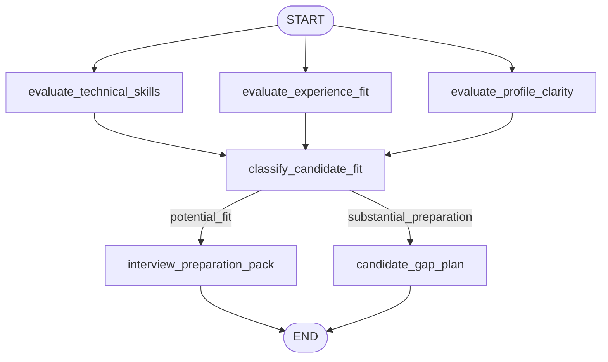

# Candidate Evaluation Graph

A LangGraph workflow that evaluates a candidate's resume against a job description using independent specialist evaluations and a conditional preparation plan.

## What It Does

The graph accepts a candidate ID, resume, and job description. It then:

1. Evaluates technical skill alignment.
2. Evaluates experience fit across responsibilities, seniority, domain, and outcomes.
3. Reviews resume clarity, evidence, and measurable impact.
4. Classifies the candidate as either `potential_fit` or `substantial_preparation`.
5. Generates an interview preparation pack or a candidate gap plan.



## Requirements

- Python 3.10 or newer
- An OpenAI API key
- Packages listed in `requirements.txt`

## Setup

Create and activate a virtual environment:

```powershell
python -m venv .venv
.\.venv\Scripts\Activate.ps1
```

Install dependencies:

```powershell
python -m pip install -r requirements.txt
```

Create a `.env` file in the project directory:

```env
OPENAI_API_KEY=your_openai_api_key
```

The application loads this value automatically with `python-dotenv`.

## Run the Example

The Python file contains a sample resume and job description in its `__main__` block:

```powershell
python candidate_evaluation_graph.py
```

The script prints the candidate ID, fit classification, all three specialist evaluations, and the final preparation output.

## Use the Graph in Python

Import `EvaluationInput` and `evaluate_candidate` to evaluate your own candidate:

```python
from candidate_evaluation_graph import EvaluationInput, evaluate_candidate

candidate = EvaluationInput(
    candidate_id="C002",
    candidate_resume="Candidate resume text...",
    job_description="Job description text...",
)

result = evaluate_candidate(candidate)

print(result["candidate_fit"])
print(result["final_output"])
```

## Result Fields

The returned state includes:

- `candidate_id`: The supplied candidate identifier.
- `candidate_resume`: The supplied resume.
- `job_description`: The supplied job description.
- `technical_evaluation`: Technical skill comparison and evidence.
- `experience_evaluation`: Experience and seniority comparison.
- `profile_clarity_evaluation`: Resume clarity and impact assessment.
- `candidate_fit`: Either `potential_fit` or `substantial_preparation`.
- `final_output`: An interview preparation pack or a prioritized gap plan.

## Project Files

- `candidate_evaluation_graph.py`: LangGraph workflow and runnable example.
- `requirements.txt`: Python dependencies.
- `.env`: Local environment variables; do not commit API keys.

## Notes

Each specialist node calls `gpt-4.1-mini`. The three specialist evaluations begin independently, and the classification node runs after all three are complete. The final conditional route is based on the structured `candidate_fit` decision.
